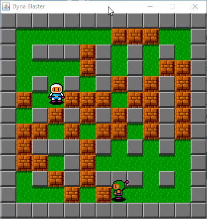
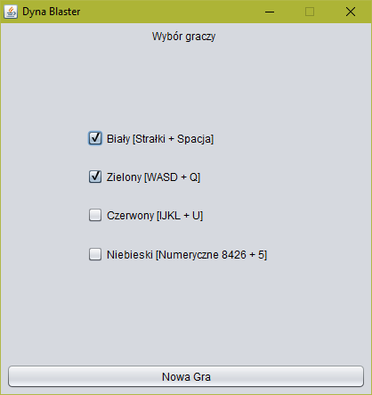
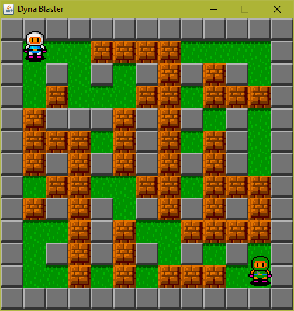
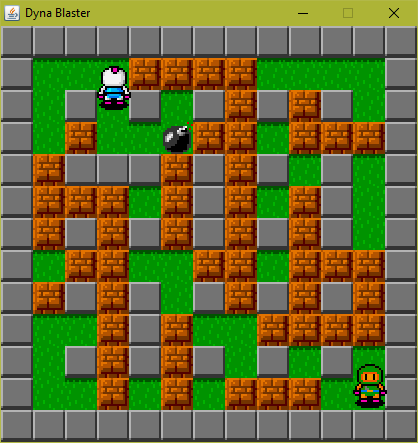
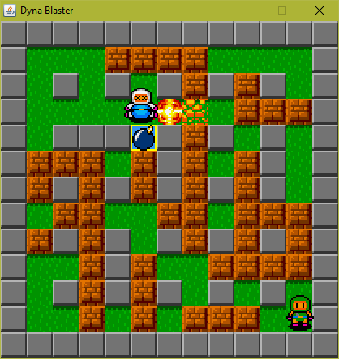

# DynaBlaster

Projekt zaliczeniowy z programowania w języku Java. Jest to klon gry DynaBlaster, w której dwóch lub więcej graczy gra przeciwko sobie próbująć wysadzić przeciwnika przy pomocy bomb.

# Zdjęcia

# Menu

# Gra

# Instalacja

Program został napisany w NetBeans. Do uruchomienia wystarczy zainstalowanie i instalacja oprogramowania NetBeans (z językiem Java) oraz uruchomienie projektu poleceniem "Run".

# Grafika

Grafika gry została zaczerpnięta z plików oryginalnej wersji gry. 